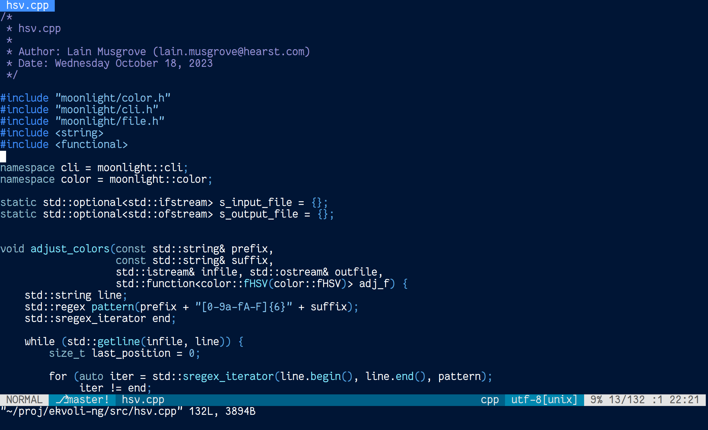

# `ekvoli-ng`: Different shades of blue, now in all colors of the rainbow
## About Ekvoli
[Ekvoli](https://www.vim.org/scripts/script.php?script_id=1681) is a beautiful
"different shades of blue" Vim colorscheme developed by Preben Randhol in 2006.
Of all the colorschemes I've ever tried in the past 17 years, I always
gravitate back to Ekvoli.  Nothing beats it for me in terms of comfort of
reading, aesthetic beauty, and code clarity.

## Goals
This project's goal is to take the beautiful Ekvoli colorscheme and adjust the
overall HSV values of all of the colors to arrive at base color motifs of the
same contrast ratios.

This project also aims to extend Ekvoli into systems beyond Vim, by re-interpreting
it into the wonderful [Base16](https://github.com/chriskempson/base16) framework
so that it (or a colorscheme like it) may be utilized in many different applications.

Finally, this project hosts the code for `hsv`, a simple command line tool for
applying HSV transformations to the 6-digit hex color values in a file.  This can
be used to great effect to customize a wide variety of colorschemes, so long as
their colors are represented this way.

## Usage
If you would just like to use the pre-made colorways I've configured, follow the
guides below.  If you would like to make your own Ekvoli (or other colorscheme)
variants, see below.

### Vim
Add `lainproliant/ekvoli-ng` as a Vundle/Plug/whatever plugin.

### Base16
See [base16-utils](https://github.com/lainproliant/base16-utils) for an example
of how you can setup a framework to automate the colorways of all sorts of
different apps by utilizing
[base16-builder](https://github.com/base16-builder/base16-builder).

## The `hsv` Tool
See `build.py` for examples of how the `hsv` tool is applied to `ekvoli.vim`
and `ekvoli.yaml`.  Experiment with different HSV adjustment values and see
what you end up with!
